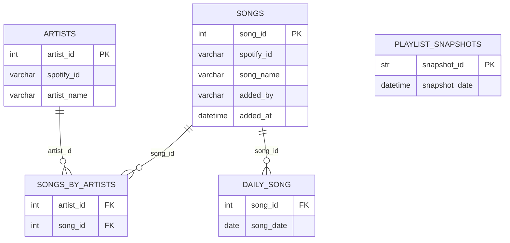

# Playlist tracking app

An application monitors real-time updates to Spotify playlists,
delivering notifications about changes and select daily song for Twitter followers.

## Technology

- Python 3.10 with [SQLModel, FastAPI, Tweepy and others](https://github.com/zawislakm/RatPartyMixTracker/blob/master/config_files/requirements.txt)
- PostgreSQL
- Oracle Cloud - VM
- Docker
- GitHub Actions

The app regularly checks for updates on the playlist and selects a  daily song to share with Twitter followers.
API provides information about daily song to [DiscordBot]((https://github.com/JakubDralus/discord-bot)) and allows 
to set a daily songs for future days. 
The application is deployed on an Oracle Cloud virtual machine, utilizing a PostgreSQL database. 
It is containerized with Docker and deployed seamlessly through GitHub Actions.

## RatPartMix links

1. [RatPartMix - Spotify](https://open.spotify.com/playlist/0RHhiQ6hGLKgjE7eqNdXzh?si=42gbm0djRZ25L4x0Tq-d_Q&nd=1)
2. [RatPartyMix - Twitter](https://twitter.com/RatPartyMix)
3. [RatPartMix - DiscordBot](https://github.com/JakubDralus/discord-bot)

